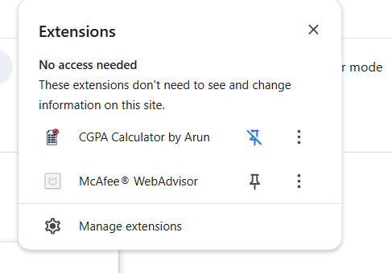

# CGPA Calculator Chrome Extension

**Made by Arun Sanjeev**

Calculate and display your CGPA directly on the [camsmkce.in](https://camsmkce.in/) ERP Grades pages and Result Publishing Page.

  </a>
  
  
  
  

  

  
  
  
    
   
  

  

## Features

- Automatically detects your grades table and extracts **semester, credit, and grade**.
- Computes **overall CGPA** and **semester-wise GPA**.
- Floating **overlay on the ERP page** (can be dismissed).
- Popup UI showing **breakdown** and **raw table rows**.
- Stores the **last computed data** in Chrome local storage for quick access.

---

## Installation (Unpacked)

1. Open Chrome and navigate to `chrome://extensions/`.
2. Toggle **Developer mode** (top-right corner).
3. Click **Load unpacked** and select the folder containing this extension.
4. Visit your grades page on [camsmkce.in](https://camsmkce.in/).
5. The overlay will appear automatically; click the extension icon to view detailed popup info.

---

## Development

- Changes to `manifest.json` require clicking **Reload** on the extension card.
- For JS, HTML, or CSS updates, a simple page reload is sufficient.
- Use **console logs** for debugging content scripts.

---

## Adjusting Column Indexes

If your ERP grades table structure changes:

1. Open `content.js`.
2. Look for the `parseTable()` function.
3. Adjust the **column indices** for semester, credits, and grade as needed.

---

## Security & Privacy

- No network requests are made.
- All data stays **local** in Chrome storage.
- You can safely remove or modify storage logic as per your requirements.

---

## Screenshots

### Extension Overlay on Grades Page

### Extension in Menu Bar

### Popup

### GPA and Credits

---

## Contributing

1. Fork this repository.
2. Make your changes.
3. Submit a pull request.

---

## License

MIT License – free to use and modify.
